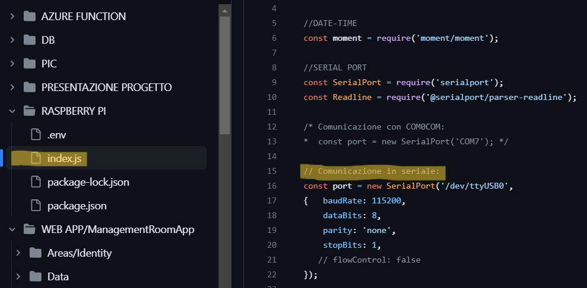
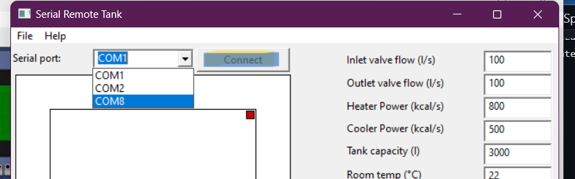
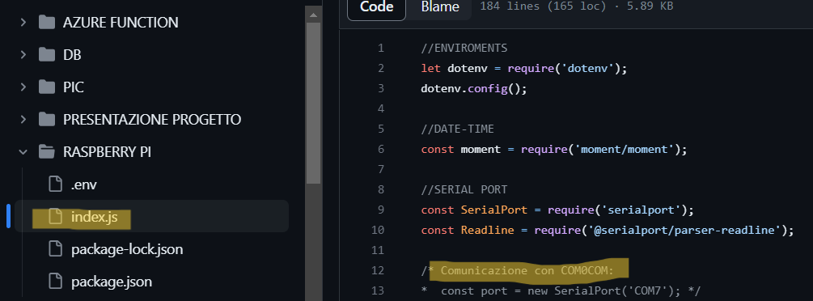
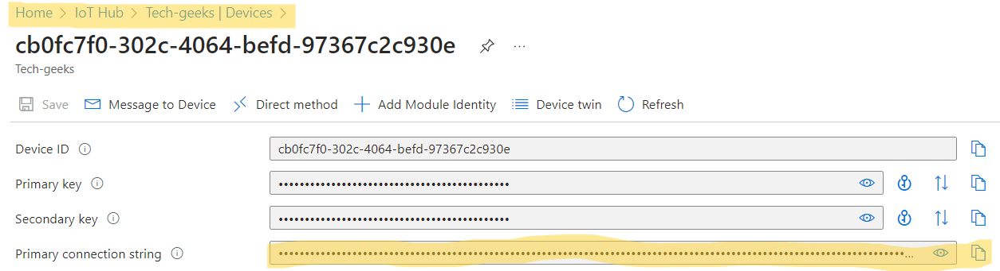
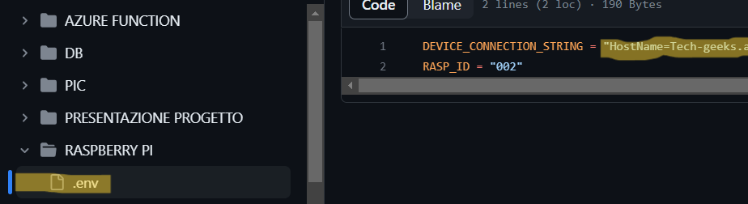
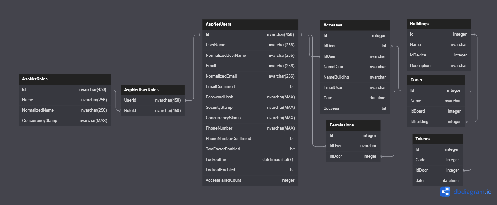
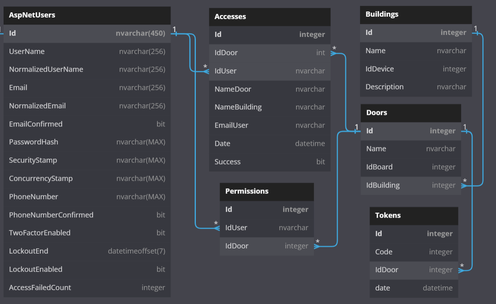
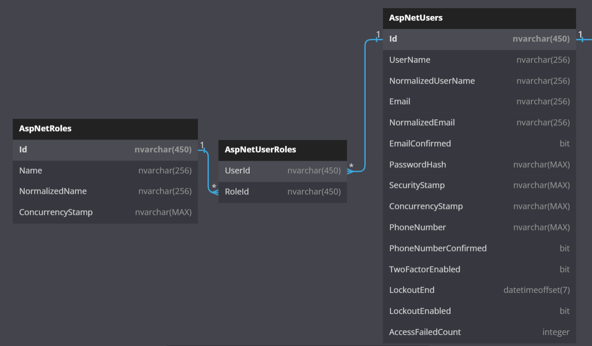
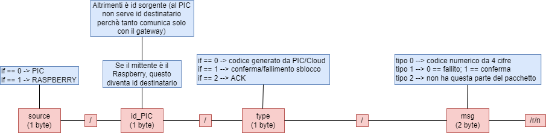

# Project Work A2 by TechGeeks
## Il problema
### Il contesto
Viene commissionata la realizzazione di un sistema di sblocco delle porte delle stanze degli edifici di un campus universitario.
### Tecnologie disponibili
 - PIC16F877A
   - Interfaccia seriale RS485
 - Raspberry Pi
   - Interfaccia seriale RS485
   - Interfaccia di rete wireless
 - MS Azure
   - IoT Hub
   - Service bus
   - Web App
   - SQL Azure
 - Web browser
### Requisiti funzionali minimi
 - Lo sblocco deve avvenire a seguito di una verifica in due passaggi
   1.  Un primo codice di sblocco dev'essere generato dalla porta, tramite interazione diretta dell'utente, che deve poter visualizzare la combinazione generata
   2.  Il primo codice dev'essere convalidato su un portale web, dove l'utente può inserire la combinazione di cifre visualizzata alla porta
   3.  In caso di avvenuta convalidazione sul portale viene generato un secondo codice, che dev'essere visualizzato dall'utente
   4.  L'immissione della seconda combinazione da parte dell'utente deve avvenire alla porta
   5.  La seconda convalidazione può avvenire sul portale o sulla porta
 - Gli utenti con privilegio di amministratore hanno accesso a risorse speciali del portale
   - Visualizzazione cronologia accessi
   - Espulsione utenti standard dalla piattaforma
   - Modifica dei privilegi degli utenti standard
   - Blocco e sblocco di edifici e/o relative porte
   - Modifica dei permessi di accesso alle porte degli utenti
 - Gli utenti devono autenticarsi per accedere alla piattaforma
## La nostra soluzione
### Requisiti tecnici infrastrutturali
Per mettere in funzione il sistema implementato e testarne il comportamento sono necessari:
- Uno o più simulatori del PIC16F877A, istanziati attraverso PicSimLab
  - Simulano i dispositivi di sblocco, che nel contesto reale vengono applicati alle singole porte degli edifici
  - [Script da caricare in PicSimLab](PIC/Code/main.c)
- Dispositivi gateway (uno per edificio)
  -  Uno o più Raspberry Pi con os Ubuntu, collegati serialmente al pc o ai pc su cui sono istanziati i simulatori dei PIC
     - Ognuno di essi va cablato con interfaccia USB al gateway
       - E' necessario referenziare coerentemente le porte effettivamente interconnesse su
         - [index.js](RASPBERRY_PI/index.js) 

         - Serial Remote Tank, tool di PicSimLab

     - [Progetto Node.js da importare e avviare sul dispositivo Ubuntu](RASPBERRY_PI)
  - In alternativa, uno o più simulatori Node.js istanziati su Windows
     - Qualora i simulatori dei PIC e quelli dei Raspberry vengano istanziati sullo stesso pc, sono necessari, per ogni simulatore di PIC istanziato
         - una interfaccia seriale virtuale riservata per quel PIC (suggerito l'impiego di Com0Com)
         - una interfaccia seriale virtuale riservata per il suo gateway di riferimento
     - Resta necessario identificare opportunamente su [index.js](RASPBERRY_PI/index.js) e su Serial Remote Tank le effettive porte seriali interconnesse

- Istanza Azure IoT Hub
  - Un Device per gateway istanziato
    - La sua connection string dev'essere dev'essere opportunamente riportata in [.env](RASPBERRY_PI/.env)

    - Il suo Id dev'essere correttamente inserito nel from di registrazione del relativo edificio sul portale web

  - Un'unica istanza Service Bus Queue che raccolga i messaggi provenienti da tutti i Device istanziati
    - Il suo id dev'essere opportunamente referenziato nel progetto [Azure Function](AZURE_FUNCTION/CloudManagementData)
- Visual Studio per eseguire il progetto dell'Azure Function deputata a processare la coda di messaggi del Service Bus
  - [Progetto Azure Function](AZURE_FUNCTION/CloudManagementData)
- Istanza Azure Web App e SQL Azure intergrata (o Visual Studio per l'esecuzione in ambiente locale) per l'avvio dell'app e l'hosting del database associato
  - [Progetto portale web](WEB_APP/ManagementRoomApp)
- Un dispositivo in grado di visualizzare pagine web
  - E' necessario conoscere l'URL della home page del portale di sblocco
    - In esecuzione locale
    - In esecuzione sul cloud
### Guida alle funzionalità
Ogni attività rilevante ai fini della piattaforma viene opportunamente documentata in un istanza di SQLServer

#### Configurazione centralina della porta
1. All’accensione, il programma verifica se nel registro 0 della EEPROM è memorizzato l’id, corrispondente al numero della porta
1. In caso negativo, viene richiesto all’amministratore di digitarlo, per poi salvarlo premendo “#”
   - Se quello digitato è maggiore di 250 o vuoto viene riavviata la procedura
   - In caso contrario viene stampato un messaggio di completamento della configurazione
#### Portale web
##### Registrazione utente
- Il servizio di autenticazione e autorizzazione è gestito interamente dal framework AspNetIdentity, integrato nell'app
- I ruoli di utente standard 'Utenti' e qeullo di amministratore 'Amministratori' vanno inseriti manualmente nella tabella AspNetRoles prima di registrare utenti
- Il primo utente amministratore deve venire preregistrato anch'esso
  - Insert tabella AspNetUsers
  - Insert tabella AspNetUserRoles con ruolo 'Amministratori'
- Alla registrazione, l’utente non dispone di alcun permesso di accesso alle porte
  - Insert tabella AspNetUsers
  - Insert tabella AspNetUserRoles con ruolo 'Utenti'
##### Facoltà utente amministratore
- Funzionalità legate alla gestione delle porte

  - Aggiungere o rimuovere edifici e, quindi, le loro porte
    - Insert/Delete tabella Buildings
    - Insert/Delete tabella Doors
  - Aggiungere o rimuovere porte di edifici, assicurandosi che gli id inseriti corrispondano a quelli registrati nelle EEPROM dei dispositivi a esse associati
    - Insert/Delete tabella Doors
  - Visualizzare gli accessi effettuati presso qualsiasi porta
    - Select tabella Accesses
  - Modificare i permessi di accesso di ogni utente alle singole porte
    - Insert/Delete tabella Permissions
- Funzionalità gestite da AspNetIdentity

  - Modificare i privilegi utente
    - Delete e insert tabella AspNetUserRoles
  - Rimuovere utenti
    - Delete tabella AspNetUsers
    - Di conseguenza, delete tabella AspNetUserRoles
#### Procedura di sblocco
1. Viene visualizzato il messaggio “Premi #”
1. L’utente preme “#”
1. Il Pic rileva la pressione e genera un codice randomico di 4 cifre, che
   1. stampa sul display
   1. converte in stringa
1. Viene creato un pacchetto RS485 col codice
   - "0/0/Code"
   
   Modello protocollo
   
     
   
1. Il pacchetto viene inviato alla porta seriale
1. Viene generato un timer casuale compreso tra 5 e 15 secondi (per evitare nuovamente la collisione)
   - Se entro il timer non riceve il messaggio di tipo ACK viene spedito nuovamente il pacchetto
   - Se viene ricevuto viene generato un timer di 30 secondi per impedire la generazione di un nuovo codice da parte di un utente
1. Il messaggio raggiunge la Raspberry (che riconosce il delimitatore di pacchetti “/r/n”)
   1. Viene verificato che il pacchetto non sia un messaggio ACK
   1. Conversione del messaggio da RS485 a JSON
      1. Deserializzazione a partire dai separatori “/”
      2. Viene composto il messaggio per il device dell’IoT Hub associato al gateway coinvolto
     
             {
     
                TypeOfMessage
     
                Device: (IdGateway)
     
                Board: (IdDoor)
     
                Code
     
                Date: moment().format()
     
              }
        
   2. Invio del messaggio all’indirizzo del relativo device dell'istanza dell'IoT Hub
     1. Reindirizzamento automatico del messaggio alla bus queue
        1. Attesa scodamento
   1. Invio dell’ACK al Pic
       - "1/Board/2"
1. Una Azure Function consuma i messaggi della coda discriminando il parametro TypeOfMessage
      - Se uguale a 0, viene eseguito l'inserimento di un nuovo record nella tabella Tokens
1. Autenticazione dell’utente sull’app
1. Convalidazione del token
   - Non corrispondenza
     1. Messaggio di errore
   - Corrispondenza
     1. Inserimento nuovo record nella tabella Accesses, con campo Success a 0
     2. Visualizzazione del secondo codice da parte dell'utente
     3. Invio codice all'indirizzo del device di provenienza del primo codice
1. Ricezione sul gateway del messaggio col secondo codice
   
               {
   
                 IdBoard: (IdDoor)
   
                 Code
   
                 IdUser
   
               }
   
1. Memorizzazione della coppia IdDoor - IdUser in memoria locale, così da poter effettuare l’associazione tra successivo messaggio di sblocco e utente generatore del secondo codice
1. Generazione e invio del pacchetto al Pic
   - "0/IdDoor/1/Code"
1. Generazione timer per la ricezione dell’ACK e, eventualmente, nuovo tentativo di invio del pacchetto 
1. Ricezione secondo codice sul Pic
1. Invio ACK al Raspberry
   - "0/2"
1. Tre tentativi di immissione del secondo codice da parte dell'utente e convalidazione 
   - In caso di riuscita
     1. Generazione pacchetto con la conferma dello sblocco
        - "0/1/1"
     1. Messaggio di sblocco sul display
     1. Attesa ACK e eventuale rinvio
   - In caso di fallimento
     1. Generazione pacchetto di fallimento procedura
        - "0/1/0"
     1. Messaggio di rifiuto sul display
     1. Attesa ACK e eventuale rinvio
1. Ricezione messaggio di sblocco sul Raspberry
1. Associazione del messaggio al mittente confrontando le associazioni memorizzate
1. Composizione messaggio di sblocco
      
             {
      
                TypeOfMessage
      
                Device: (RASP_ID)
      
                Board:(DOOR_ID)
      
                Success
      
                Date: moment().format()
      
                IdUser
      
             }
      
3. Invio al Device
4. Invio ACK al PIC
   - "1/IdBoard/2"
1. Scodamento
   - Se il messaggio è di sblocco riuscito (TypeOfMessage == 1) viene aggiornato il relativo record di Accesses, portandone il campo Success a 1

##### Precisazioni
- Non è previsto che l’utente non effettui il tentativo di convalida del secondo codice sulla porta!
- Solo un utente per volta può effetturare il tentativo di accesso a una specifica porta!
  - Ogni nuovo messaggio di secondo codice ricevuto dal Raspberry per la specifica porta sovrascrive l'eventuale precedente messaggio indirizzato alla medesima
    - Ogni codice ricevuto dal PIC sovrascrive, se presente, quello attualmente in attesa di convalidazione
  - Se, a seguito della sovrascrittura, viene ricevuto un messaggio di sblocco proveniente dal PIC nessuna associazione al mittente viene effettuata e le informazioni inerenti lo sblocco non pervengono alla queue!
 ##### Suggerimenti post-esposizione
 - Il protocollo potrebbe essere ottimizzato rimuovendo il primo byte di informazione
   - Infatti, essendo che un PIC comunica unicamente col proprio gateway, è sufficiente verificare la presenza del byte di id della porta per discriminare il tipo di sorgente
- Se un utente viene espulso dalla piattaforma, stessa sorte tocca alla cronologia dei suoi accessi!
  - Sarebbe opportuno implementare anche il servizio di attivazione e disattivazione temporanee delle utenze, così da renderne persistenti alcune informazioni correlate nonostante l'impossibilità di loggarsi
